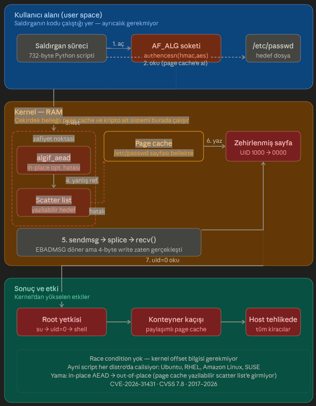

# Copy Fail: 9 Yıldır Gizlenen Linux Açığı

`CVE-2026-31431` · Linux Güvenliği

> 732 byte'lık bir Python scripti ile Ubuntu, RHEL, Amazon Linux ve SUSE'de nasıl root yetkisi elde edilir — ve bu nasıl mümkün oldu?

**30 Nisan 2026** · 8 dakikalık okuma · Linux · Güvenlik Açıkları · Kernel

---

```python
# AF_ALG soketi aç, authencesn algoritmasına bağlan
sock = socket(AF_ALG, SOCK_SEQPACKET)
sock.bind(("aead", "authencesn(hmac(sha256),cbc(aes))", ...))

# /etc/passwd'daki UID alanını bul (offset hesapla)
offset = find_uid_offset("/etc/passwd", uid=1000)

# Sayfa önbelleğine 4 byte yaz: UID → 0000 (root)
write4(sock, target="/etc/passwd", offset=offset, data=b"0000")

# Root shell al
os.execvp("su", ["su", username])  # → #
```

*CVSS 7.8 · Yüksek · 2017'den bu yana tüm büyük Linux dağıtımları etkileniyor*

---

## Nedir bu "Copy Fail"?

30 Nisan 2026'da Theori ve Xint.io güvenlik araştırmacıları, Linux çekirdeğinde tam dokuz yıldır var olan ve hiç fark edilmemiş kritik bir güvenlik açığını kamuoyuyla paylaştı. **CVE-2026-31431** ya da araştırmacıların adlandırdığı şekliyle **"Copy Fail"**, yerel bir kullanıcının herhangi bir ayrıcalık gerektirmeksizin **root yetkisi** elde etmesine olanak tanıyor.

Açığın korkutucu tarafı sadece ciddiyeti değil; ne kadar *basit* olduğu. Yarım kilobaytı bile bulmayan tek bir Python scripti, 2017'den bu yana üretilen neredeyse her Linux sistemde işe yarıyor.

| Alan | Değer |
|:--|:--|
| **CVSS Skoru** | 7.8 (Yüksek) |
| **İlk Ortaya Çıkış** | 2017 (Ağustos commit'i) |
| **Exploit Boyutu** | 732 B (Python scripti) |
| **Tür** | LPE — Yerel yetki yükseltme |

---

## Teknik Kök Neden: algif_aead'daki Mantık Hatası

Açığı anlamak için Linux çekirdeğinin **AF_ALG** (Algorithm) soket arayüzünü bilmek gerekiyor. AF_ALG, kullanıcı alanı programlarının çekirdekteki kriptografik işlemlere erişmesini sağlar — şifreleme, hash alma, kimlik doğrulama gibi.

2017'de yapılan bir performans optimizasyonuyla birlikte `algif_aead` modülüne "yerinde (in-place) işlem" desteği eklendi. Bu optimizasyon, AEAD (Authenticated Encryption with Associated Data) işlemlerini daha hızlı yapıyor; ancak beraberinde ölümcül bir hata getiriyor:

> *Bir sayfa önbelleği sayfası, çekirdeğin yazılabilir hedef scatter listine girebiliyor. Yani "sadece okunabilir" olması gereken bir dosyanın bellek sayfasına doğrudan yazılabiliyor.*

Saldırgan bu durumu fark edince `splice()` sistem çağrısını bu sokete yönlendiriyor ve sahip olmadığı bir dosyanın sayfa önbelleğine küçük, hedefli bir yazma gerçekleştiriyor. Dosya disk üzerinde değişmeden kalıyor; ama okunan şey bellekteki kopyası — ve o artık saldırganın değiştirdiği veri.

### Exploit Adımları

**1. AF_ALG soketi aç ve bağlan**
`authencesn(hmac(sha256),cbc(aes))` algoritmasına bağlanan bir AEAD soketi oluşturulur. Bu işlem için root yetkisi gerekmez.

**2. /etc/passwd'ı sayfa önbelleğine al**
Hedef dosya okunarak sayfa önbelleğine alınır. Saldırgan, kendi UID'sinin (örn. 1000) dosyadaki byte offset'ini hesaplar.

**3. sendmsg + splice ile 4 byte yaz**
8 byte'lık AAD, `sendmsg` ile gönderilir. Ardından `splice()` ile `/etc/passwd` sayfası sokete yönlendirilir. Kimlik doğrulama EBADMSG ile başarısız olur — ama yazma işlemi çoktan gerçekleşmiştir.

**4. su komutuyla root shell al**
libc artık kullanıcının UID'sini 0 (root) olarak görür. `su` komutu çalıştırılır, kendi parolanız girilir ve root shell elde edilir.

> ⚠️ **Kritik nokta:** Bu exploit herhangi bir yarış koşulu (race condition) veya çekirdek adresi bilgisi gerektirmiyor. Düz bir mantık hatası. Güvenilirlik olasılıksal değil — her seferinde çalışıyor ve aynı script farklı dağıtımlarda da işe yarıyor.


*Şekil 1: algif_aead mantık hatası üzerinden Page Cache zehirleme ve yetki yükseltme akışı.*


---

## Dirty Pipe ile Karşılaştırma

Güvenlik camiasında Copy Fail, hemen 2022'nin en çok konuşulan Linux açığı Dirty Pipe (CVE-2022-0847) ile karşılaştırıldı. İkisi aynı "primitive sınıfı" — ama farklı alt sistemlerde çalışıyor.

| Özellik | Copy Fail (2026) | Dirty Pipe (2022) |
|:--|:--|:--|
| Alt sistem | algif_aead (crypto) | pipe (boru hattı) |
| Kök neden | 2017 in-place optimizasyon hatası | Flag sıfırlama hatası |
| Yöntem | sendmsg + splice zinciri | pipe + splice zinciri |
| Yarış koşulu | Gerektirmiyor | Gerektirmiyor |
| Ek risk | Konteyner atlatma mümkün | Aynı sınıf primitive |

---

## Konteyner Ortamları için Özel Risk

Copy Fail, geleneksel sistemlerde tehlikeli — konteynerli ortamlarda ise katmerli biçimde tehlikeli. Bunun nedeni Linux'un sayfa önbelleğinin *tüm konteynerler arasında paylaşılması*.

Bir konteynerdeki saldırgan, zafiyeti kullanarak ana makine sayfa önbelleğine yazabilir. Bu, aynı fiziksel sunucudaki diğer tüm konteynerleri etkileyebilir. Namespace izolasyonuna dayanan güvenlik modelleri bu saldırıyı durduramıyor.

> *"Konteynerler asla güvenlik sınırı olmak için tasarlanmadı."* — Bugcrowd, David Brumley

---

## Nasıl Bulundu? Yapay Zeka Faktörü

Copy Fail'in keşfedilme hikayesi, teknik detayları kadar dikkat çekici. Theori araştırmacısı Taeyang Lee bu açığı bulurken Xint Code adlı yapay zeka destekli güvenlik analiz sistemini kullandı. Theori'nin açıklamasına göre: tek bir operatör komutu, yaklaşık bir saatlik tarama süresi — ve Linux `crypto/` alt sistemindeki bu dokuz yıllık açık gün yüzüne çıktı.

Bu, güvenlik araştırmacılarının uzun süredir tartıştığı bir dönüşüme işaret ediyor: çekirdek sınıfı açık bulmak artık pahalı ve zaman alıcı olmak zorunda değil.

---

## Çözüm ve Alınacak Önlemler

- ✅ Linux çekirdek güvenlik yamalarını derhal uygulayın — upstream fix, in-place AEAD işlemlerini out-of-place'e döndürüyor.
- ✅ Ubuntu, RHEL, Amazon Linux, SUSE kullanıcıları dağıtım sağlayıcısının güvenlik bültenini takip etmeli.
- ✅ Konteyner ortamlarında izolasyon stratejisini gözden geçirin — namespace değil, VM/donanım sınırlarına dayanan mimari tercih edin.
- ✅ Sisteminizin savunmasız olup olmadığını test etmek için Theori'nin yayınladığı test scriptini kullanabilirsiniz.
- ✅ NSS önbellek daemonlarını (nscd, sssd) kontrol edin — bunlar exploit sonrası UID değişikliğini maskeleyebilir.

---

*Copy Fail bize iki şeyi hatırlattı: Güvenlik borcu birikmez, patlar. Ve yapay zeka destekli güvenlik araçları artık sadece savunmacıların değil, araştırmacıların da elinde. Bu denklemi kimin lehine değiştireceği, kurumların yama süreçlerine ne kadar hız kazandıracağına bağlı.*