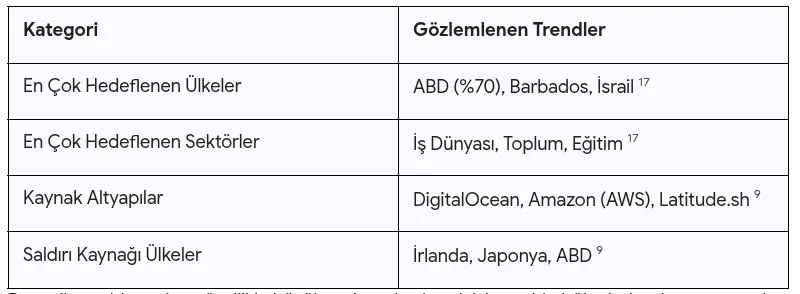

# CVE-2026-41940: cPanel ve WHM Sistemlerinde Kimlik Doğrulama Atlatma Zafiyetinin Derinlemesine Analizi


Modern internet altyapısının temel taşlarından biri olan web barındırma kontrol panelleri, milyonlarca web sitesinin, veritabanının ve e-posta sisteminin yönetimini merkezi bir noktada toplar. Bu ekosistemin en baskın oyuncusu olan cPanel ve Web Host Manager (WHM), 2026 yılının başlarında internet tarihinin en kritik güvenlik açıklarından biriyle karşı karşıya kalmıştır.

 CVE-2026-41940 olarak tanımlanan bu zafiyet, saldırganların herhangi bir kimlik bilgisine ihtiyaç duymadan sunucularda tam idari kontrol (root erişimi) elde etmesine olanak tanıyan bir kimlik doğrulama atlatma açığıdır. CVSS v3.1 puanı 9.8 (Kritik) olarak belirlenen bu durum, zafiyetin sömürülmesinin ne kadar kolay olduğunu ve sonuçlarının ne kadar yıkıcı olabileceğini açıkça ortaya koymaktadır. Bu rapor, zafiyetin teknik kökenlerini, sömürü aşamalarını, savunma stratejilerini ve küresel barındırma ekosistemi üzerindeki geniş kapsamlı etkilerini analiz etmektedir.

## Teknik Analiz ve Kök Neden: 

### CRLF Enjeksiyonu ve Oturum Mantığı

CVE-2026-41940 zafiyetinin merkezinde, cPanel servis daemonu olan cpsrvd içindeki hatalı bir oturum yükleme ve kaydetme mantığı yer almaktadır.cpsrvd, hem kullanıcı arayüzü olan cPanel'i hem de sunucu genelindeki idari arayüz olan WHM'yi yöneten ana süreçtir. Zafiyet, sistemin kullanıcıdan gelen HTTP Basic Authorization başlıklarını (headers) işleme biçimindeki bir eksiklikten kaynaklanmaktadır. Spesifik olarak, sistem bu başlıklar içindeki Carriage Return (Satır Başı - \r) ve Line Feed (Satır Besleme - \n) karakterlerini, veriyi diskteki oturum dosyasına yazmadan önce düzgün bir şekilde temizlememektedir.

Barındırma sunucusunda bir oturum açma girişimi gerçekleştiğinde, cpsrvd süreci henüz kimlik doğrulaması tamamlanmadan önce /var/cpanel/sessions/raw/ dizini altında geçici bir oturum dosyası oluşturur. Bu dosya, oturumun durumunu belirleyen anahtar-değer çiftlerini içerir. Saldırganlar, Authorization başlığına gömülü ham \r\n karakterlerini kullanarak, oturum dosyasının yapısını manipüle edebilir ve yeni satırlar ekleyebilirler. Bu işlem, saldırganın oturum dosyasına user=root veya hasroot=1 gibi kritik idari özellikleri doğrudan enjekte etmesine olanak tanır. Sistem daha sonra bu manipüle edilmiş dosyayı okuyup oturumu yüklediğinde, saldırganı doğrulanmış bir root kullanıcısı olarak kabul eder.

Zafiyetin karmaşıklığını artıran bir diğer unsur, cPanel'in oturum verilerini hem ham metin dosyalarında hem de bir JSON önbelleğinde (cache) sakladığı çift depolama (dual-storage) yapısıdır. Araştırmalar, bu iki depolama alanı arasında bir yarış durumu (race condition) olduğunu ve saldırgan tarafından enjekte edilen verilerin bu pencere boyunca kalıcı olduğunu ve kimlik doğrulama katmanı tarafından güvenilir kabul edildiğini göstermiştir.2 Ayrıca, saldırganların whostmgrsession çerezi (cookie) içindeki belirli segmentleri, örneğin kodlanmış bir virgül olan %2c karakterini kasten çıkararak, sistemin saldırgan tarafından sağlanan değerleri şifrelemesini engelleyebildiği ve verilerin sunucu tarafında düz metin olarak işlenmesini sağladığı tespit edilmiştir.

## Zafiyetin Nedenleri: Yazılım Tasarımı ve Güvenlik Eksiklikleri

CVE-2026-41940'ın temel nedeni, kritik bir fonksiyon için kimlik doğrulamasının eksik olması (CWE-306) ve girdi denetiminin yetersizliğidir.10 Bu durumun oluşmasına zemin hazırlayan birkaç stratejik ve teknik faktör bulunmaktadır:

### Girdi Sanitizasyonu Eksikliği: 

Sistemin, HTTP başlıkları gibi dışarıdan gelen verileri bir dosya formatına yazarken CRLF karakterlerine karşı filtreleme yapmaması, uygulama seviyesindeki bir mantık hatasını doğrudan dosya sistemi manipülasyonuna dönüştürmüştür.

### Hatalı Oturum Yaşam Döngüsü: 

Kimlik doğrulaması henüz gerçekleşmemiş bir talep için sunucu tarafında düzenlenebilir bir oturum dosyasının oluşturulması, saldırganlara saldırı vektörünü yerleştirebilecekleri bir "alan" sağlamıştır.8

### Güvenlik Katmanlarının Atlanması: 

Zafiyetin, cPanel'in standart olarak sunduğu iki faktörlü kimlik doğrulama (2FA) mekanizmalarını bile işlevsiz bırakması, tasarımın en derin katmanlarında bir hata olduğunu göstermektedir.

Aşağıdaki tablo, zafiyetin teknik bileşenlerini ve zayıflık türlerini özetlemektedir:


### Saldırganların Sömürü Aşamaları ve Örnekleri
Saldırganlar, CVE-2026-41940 zafiyetini sömürmek için genellikle dört ana adımdan oluşan bir saldırı zinciri kullanmaktadır. Bu süreç, herhangi bir özel kimlik bilgisi gerektirmediği için düşük karmaşıklığa sahiptir.
### Aşama: Keşif ve Versiyon Tespiti
Saldırganlar, internete açık cPanel örneklerini tespit etmek için Shodan veya Censys gibi tarama motorlarını kullanır. Yaklaşık 1,5 milyon örneğin potansiyel olarak risk altında olduğu bildirilmiştir.5 Saldırgan, /openid_connect/cpanelid gibi uç noktaları sorgulayarak hedef sistemin ana bilgisayar adını ve versiyon bilgilerini elde eder.
### Aşama: Ön-Kimlik Doğrulama Oturumunun Başlatılması
Saldırgan, /login/?login_only=1 uç noktasına bir POST isteği gönderir. Bu istek aslında başarısız bir oturum açma girişimidir, ancak cPanel mimarisi gereği sunucuda bir oturum dosyası oluşturulur ve istemciye bir whostmgrsession çerezi döndürülür.
### Aşama: CRLF Pay yükünün Enjeksiyonu
Saldırgan, elde ettiği oturum kimliğini kullanarak yeni bir istek gönderir. Bu isteğin Authorization başlığı, Base64 ile kodlanmış ve içinde \r\n karakterleri barındıran özel bir dizge içerir. Bu dizge, sunucu tarafındaki oturum dosyasına user=root ve successful_internal_auth_with_timestamp gibi verilerin yazılmasını sağlar.
Saldırganın kullandığı bir örnek manuel sömürü dizisi şu şekildedir :
GET /openid_connect/cpanelid (Hostname keşfi)
POST /login/?login_only=1 (Oturum çerezini al)
GET / + Malformed Authorization Header (Payload enjeksiyonu)
GET /scripts2/listaccts (Önbelleği temizle ve yetkiyi yükselt)
GET /cpsessTOKEN/json-api/version (Root yetkisini doğrula)

### Aşama: Yetki Yükseltme ve Tam Erişim

Payload enjekte edildikten sonra, saldırgan belirli bir API çağrısı yaparak sunucunun oturum dosyasını yeniden okumasını tetikler. Bu noktada sunucu, saldırganı sistem yöneticisi (root) olarak tanır ve saldırgan WHM arayüzüne tam erişim sağlar.

Zafiyetin kamuoyuna açıklanmasının ardından, karanlık web forumlarında ve GitHub üzerinde cPanelSniper gibi silahlandırılmış araçlar ortaya çıkmıştır.14 Bu araçlar, binlerce sunucuyu otomatik olarak tarayabilir, versiyon tespiti yapabilir ve tek bir komutla /etc/passwd gibi hassas dosyaları okuyabilir veya kalıcı arka kapılar (backdoors) oluşturabilir.

### Zafiyetin Sonuçları ve Etki Alanı

CVE-2026-41940'ın yarattığı risk, münferit bir web sitesi sızıntısının çok ötesindedir. Bir barındırma sunucusundaki kontrol panelinin ele geçirilmesi, o sunucuda barınan tüm müşterilerin ve verilerin tehlikeye girmesi anlamına gelir.15
Doğrudan Operasyonel Etkiler
Saldırgan root yetkisi kazandığında, WHM üzerinden aşağıdaki işlemleri gerçekleştirebilir:
Sunucu Kontrolü: Tüm sistem dosyalarına erişim, yeni kullanıcı hesapları oluşturma, SSH anahtarları ekleme ve mevcut yapılandırmaları değiştirme.2
Veri Hırsızlığı: Sunucudaki her bir cPanel hesabının veritabanlarına, e-postalarına ve dosyalarına sınırsız erişim.

####     Hizmet Kesintisi: 

Dosyaların silinmesi, veritabanlarının bozulması veya fidye yazılımı (ransomware) enjekte edilmesi suretiyle barındırma hizmetinin tamamen durdurulması.2
Geniş Ölçekli ve Dolaylı Etkiler

cPanel'in dünya genelinde yaklaşık 70 milyon alanı yönettiği tahmin edilmektedir Bu kadar geniş bir kurulum tabanında, zafiyetin küresel internet güvenliği üzerinde ciddi yan etkileri olmuştur

#### Phishing ve Malware Dağıtımı:
 Ele geçirilen meşru alan adları, saldırganlar tarafından oltalama sayfaları barındırmak, malware yaymak veya JavaScript enjeksiyonu ile kredi kartı bilgilerini çalmak (Magecart) için kullanılmaktadır.

#### Çok Kiracılı (Multi-tenant) Güvenlik Krizi:

 Barındırma sağlayıcıları için bu durum, tek bir sunucudaki sızıntının binlerce müşteriyi etkilediği bir felaket senaryosudur.

#### Ağ İçinde Yayılma:

 Saldırganlar, ele geçirdikleri web sunucularını aynı yerel ağdaki diğer kurumsal sistemlere sızmak için bir sıçrama tahtası olarak kullanabilirler.
Aşağıdaki tablo, sömürü sonrası potansiyel saldırgan eylemlerini göstermektedir:


## Savunma ve Korunma Stratejileri
Zafiyetin kritikliği ve aktif olarak sömürülmesi, sistem yöneticilerinin derhal ve kapsamlı bir müdahale planı uygulamasını gerektirmektedir. Sadece yama yapmak, geçmişteki olası sızıntıları temizlemek için yeterli olmayabilir.

### Acil Yama Uygulaması
En temel savunma hattı, cPanel yazılımını üretici tarafından sağlanan güncel sürümlere yükseltmektir. Yama işlemi tamamlandıktan sonra cpsrvd servisinin yeniden başlatılması zorunludur.4
Uygulanması gereken komut dizisi:

```bash
/usr/local/cpanel/cpanel -V        # Mevcut sürümü kontrol et
/scripts/upcp --force               # Zorunlu güncellemeyi başlat
/scripts/restartsrv_cpsrvd --hard  # Servisi yeniden başlat
```

### Ağ Düzeyinde Hafifletme (Workarounds)
Yama hemen uygulanamıyorsa, idari portlara erişim güvenlik duvarı üzerinden derhal kısıtlanmalıdır. Barındırma sağlayıcıları, zafiyetin ilk günlerinde bu portları ağ genelinde kapatma yoluna gitmiştir.

Engellenecek Portlar: 2082, 2083 (cPanel), 2086, 2087 (WHM), 2095, 2096 (Webmail) ve 2077, 2078 (WebDisk).
Erişim Kontrolü: İdari arayüzlere erişim yalnızca güvenilir ve statik IP adreslerine izin verecek şekilde yapılandırılmalıdır.

### Adli Analiz ve Tespit Çalışmaları
cPanel, aktif oturum dosyalarını sömürü izlerine karşı tarayan resmi bir ioc_checksessions_files.sh betiği yayınlamıştır. Yöneticiler bu betiği çalıştırmalı ve çıktıdaki "CRITICAL" uyarılarını ciddiye almalıdır.
Forensic Analiz Kontrol Listesi:
/var/cpanel/sessions/raw/ dizinindeki dosyalarda mükerrer pass= satırlarını kontrol edin.
Web erişim günlüklerinde (logs) %2c karakterinin eksik olduğu şüpheli cookie dizgelerini arayın.
Sistemde yetkisiz oluşturulmuş WHM hesaplarını ve /root/.ssh/authorized_keys dosyasındaki yeni anahtarları denetleyin.
### Sömürü Sonrası Temizlik
Sistemde bir sızıntı tespit edilirse, aşağıdaki adımlar izlenmelidir:
Tüm aktif oturumları temizleyin (purge).
Root, WHM ve tüm kullanıcı şifrelerini derhal değiştirin.
Veritabanı bağlantı bilgilerini ve API anahtarlarını rotasyona tabi tutun.
Sistem yapılandırma dosyalarını ve cron işlerini bütünlük kontrolünden geçirin.
Coğrafi ve Sektörel Analiz: Saldırıların Dağılımı
Güvenlik firması Imperva tarafından sağlanan veriler, CVE-2026-41940 sömürü girişimlerinin dünya genelinde nasıl dağıldığına dair önemli içgörüler sunmaktadır. Saldırıların tek bir bölgeye veya sektöre odaklanmak yerine, fırsatçı ve geniş kapsamlı bir tarama stratejisi izlediği görülmektedir.



Bu veriler, saldırganların özellikle büyük veri merkezi ayak izine sahip bölgeleri ve internete açık kurumsal altyapıları önceliklendirdiğini göstermektedir. Ayrıca, eğitim kurumlarının geniş ve bazen daha az sıkı yönetilen web altyapıları nedeniyle yüksek risk altında olduğu anlaşılmaktadır.
Gelecek Projeksiyonu ve Siber Hijyen Önerileri
CVE-2026-41940 vakası, siber güvenlik dünyasına "merkeziyetçilik riski" konusunda acı bir ders vermiştir. Dünya genelindeki web barındırma kontrol paneli pazarının %94'üne hakim olan bir yazılımdaki tek bir hata, milyonlarca işletmeyi aynı anda savunmasız bırakabilmektedir.

Siber güvenlik uzmanları, bu tür sistemik risklere karşı şu uzun vadeli stratejileri önermektedir:

### Sıfır Güven (Zero Trust) Yaklaşımı:
 İdari panellerin internete doğrudan açık olmaması, VPN veya güvenilir bir atlama sunucusu (jump server) arkasında tutulması temel bir gerekliliktir.

### Anomali İzleme: 

Oturum dosyası oluşturma süreçlerinin ve sistem ikili dosyalarındaki (binaries) değişikliklerin EDR veya XDR araçlarıyla sürekli izlenmesi, yama öncesi sömürüleri tespit etmek için kritiktir.

### Hızlı Yanıt Mekanizmaları:
 Barındırma sağlayıcıları ve kurumlar, kritik bir 0-gün açığı duyurulduğunda, yama çıkana kadar geçecek sürede ağ düzeyinde önlemleri (port kapama gibi) dakikalar içinde uygulayabilecek otomasyonlara sahip olmalıdır.


Sonuç olarak, CVE-2026-41940 sadece bir yazılım hatası değil, aynı zamanda küresel barındırma ekosisteminin ne kadar kırılgan olabileceğini gösteren bir uyarıdır. Kurumların bu tür zafiyetlere karşı tepkisel değil, proaktif bir güvenlik mimarisi geliştirmeleri, dijital varlıklarını korumak için hayati önem taşımaktadır.


